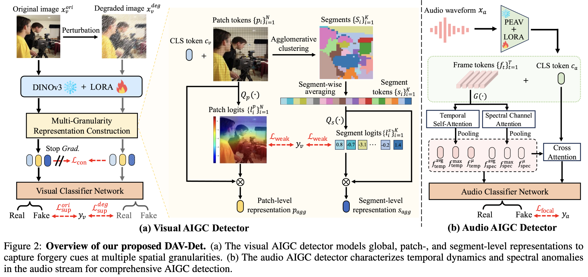

<div align="center">
  <h2><b> Less is More: Modality-Decoupling for General AIGC Audio-Video Detection </b></h2>
</div>

<div align="center">

</div>

<p align="center">
    <a href="https://github.com/tuffy-studio/DAV-Det">
    
  </a>
  &nbsp;&nbsp;&nbsp;
  <a href="https://arxiv.org/abs/tbd">
    
  </a>
  &nbsp;&nbsp;&nbsp;
  <a href="https://huggingface.co/JielunPeng/DAVDet/">
    
  </a>
</p>


# Overview

This repository contains the official implementation of "Less is More: Modality-Decoupling for General AIGC Audio-Video Detection", which is also the solution of our team (HIT VIRLAB) for the [General AIGC Audio-Video Detection challenge](https://www.codabench.org/competitions/15769/#/pages-tab) at IJCAI 2026 DDL 2.0 workshop. Our method achieved **1st** place among 101 participating teams in the final test phase.




It implements a **Decoupled Audio-Visual AIGC detection system**:

- **Audio Detector**: based on the PE-AV audio encoder + AASIST-style backend to classify audio as real or fake.
- **Video Detector**: based on the DINOv3-ViT-L/16 image encoder + GPS-DINO multi-granularity classifier to classify video as real or fake.
- **Fusion Post-processing**: combines audio and video probability predictions to produce both binary (real/fake) and four-class (RR / FF / FR / RF) outputs.

Detector Model Weights will be available at Hugging Face.
<!-- Detector Model Weights are available at: https://drive.google.com/drive/u/0/folders/1jClj7dZTBDAiyLefIwwxldNHOibhHUBF -->


<!-- ## Directory Structure

```
DAV-Det/
├── data_preprocessing/          # Data preprocessing scripts
│   ├── make_video_csv.py        # Generate video_path,label CSV from directory structure
│   ├── frame_sampling.py        # Uniformly sample frames from videos
│   └── audio_extraction.py      # Extract audio from videos as WAV using ffmpeg
├── src/
│   ├── audio_detector/          # Audio detector
│   │   ├── train.py             # Training entry point
│   │   ├── inference.py         # Inference entry point
│   │   ├── dataloader.py        # Data loading and audio augmentation
│   │   ├── loss_function.py     # Focal Loss
│   │   └── models/              # PE-AV encoder / AASIST backend / detector wrapper
│   └── video_detector/          # Video detector
│       ├── run_training.py      # DDP training entry point
│       ├── training.py          # Training loop
│       ├── inference.py         # Inference entry point
│       ├── dataloader.py        # Data loading and image augmentation
│       ├── loss_fn.py           # Focal Loss
│       └── models/              # DINOv3 / GPS-DINO / classifier modules
├── make_2_and_4_result.py       # Fuse audio and video probabilities
├── README.md                    # This file
└── Technical_Report.md          # Technical report (methodology, architecture, etc.)
```

--- -->

## Environment Setup

We recommend using separate Conda environments for the audio and video detectors to avoid dependency conflicts.

### Audio Detector Environment

```bash
conda create -n audio_detector_env python=3.11.14
conda activate audio_detector_env
pip install -r src/audio_detector/audio_requirements.txt
```

### Video Detector Environment

```bash
conda create -n video_detector_env python=3.10.20
conda activate video_detector_env
pip install -r src/video_detector/video_requirements.txt
```

---

## Data Preprocessing

### 1. Video Directory Structure

The training set should be organized as follows (four categories correspond to audio/video real-fake combinations):

```
train/
├── fake_fake/          # fake audio & fake video -> video binary label=1, audio label=1
├── fake_real/          # fake audio & real video -> video binary label=1, audio label=0
├── real_fake/          # real audio & fake video -> video binary label=0, audio label=1
└── real_real/          # real audio & real video -> video binary label=0, audio label=0
```

### 2. Generate Video Label CSV

```bash
python data_preprocessing/make_video_csv.py
```

Update `train_dir` and `output_csv` in the script. Output format:

```csv
video_path,label
/path/to/train/fake_fake/xxx.mp4,1
/path/to/train/real_real/yyy.mp4,0
```

### 3. Frame Sampling

```bash
python data_preprocessing/frame_sampling.py
```

Configuration:
- `input_csv`: CSV generated by `make_video_csv.py`
- `save_root`: root directory to save sampled frames
- `output_csv`: final `frame_path,label` CSV for video detector training

Sampling strategy:
- Real videos (label=0): uniformly sample **8 frames**
- Fake videos (label=1): uniformly sample **16 frames**

Output structure:

```
frames_sampling/
├── 0/          # real videos
│   └── {video_name}/
│       ├── 000.jpg
│       └── ...
└── 1/          # fake videos
    └── {video_name}/
        ├── 000.jpg
        └── ...
```

### 4. Audio Extraction

```bash
python data_preprocessing/audio_extraction.py
```

Configuration:
- `base_dir`: training set root directory
- `output_csv`: output `file_path,label` CSV for the audio detector

Processing logic:
- If `.wav` / `.flac` already exists in the video directory, use it directly
- Otherwise, use `ffmpeg` to extract audio as `16kHz`, `mono`, `pcm_s16le` WAV
- Multi-process parallel extraction, default up to 16 workers

---

## Pretrained Models Download

### Audio Detector Configure

| Model | Source | Placement |
|---|---|---|
| PE-AV Base | [huggingface.co/facebook/pe-av-base](https://huggingface.co/facebook/pe-av-base) | `./src/audio_detector/` |

### Video Detector Configure

| Model | Source | Placement |
|---|---|---|
| DINOv3 ViT-L/16 | [ModelScope - dinov3-vitl16-pretrain-lvd1689m](https://www.modelscope.cn/models/facebook/dinov3-vitl16-pretrain-lvd1689m) | `./src/video_detector/` or specify `--backbone_name` |

### AIGC Detection Model Weights

Competition/project final detection weights can be downloaded from:

- [Google Drive - DAV-Det Weights](https://drive.google.com/drive/folders/1jClj7dZTBDAiyLefIwwxldNHOibhHUBF?usp=sharing)

After downloading, place the weights in:

- Audio weights: `./src/audio_detector/weights/`
- Video weights: `./src/video_detector/weights/`

---

## Training

### Audio Detector Training

```bash
conda activate audio_detector_env
python src/audio_detector/train.py \
  --train_csv ./train_audio_labels.csv \
  --dev_csv ./dev_audio_labels.csv \
  --peav_checkpoint ./src/audio_detector/facebook/pe-av-base \
  --save_dir ./outputs/audio_detector \
  --batch_size 512 \
  --epochs 20 \
  --lr_head 1e-4 \
  --lr_lora 1e-4 \
  --use_lora \
  --lora_r 32 \
  --lora_alpha 64 \
  --use_deep_supervision \
  --augment
```

Key parameters:

| Parameter | Description |
|---|---|
| `--train_csv` / `--dev_csv` | Training/validation CSV (`file_path,label`) |
| `--peav_checkpoint` | PE-AV pretrained model path |
| `--save_dir` | Model save directory |
| `--use_lora` / `--lora_r` / `--lora_alpha` | LoRA configuration |
| `--use_deep_supervision` | Enable deep supervision using the last N Transformer layers |
| `--augment` / `--augment_intensity` | Audio data augmentation |
| `--use_dp` / `--gpu_ids` | Multi-GPU DataParallel |
| `--resume` / `--pretrained` | Resume training or load pretrained weights |

For more parameters, see `python src/audio_detector/train.py --help`.

### Video Detector Training

```bash
conda activate video_detector_env
torchrun --nproc_per_node=8 src/video_detector/run_training.py \
  --data_train ./train_frame_labels.csv \
  --batch_size 128 \
  --accumulation_steps 16 \
  --gpu_num 8 \
  --lr 1e-4 \
  --n_epochs 20 \
  --warmup_epochs 2 \
  --cls_loss focal \
  --save_dir ./outputs/video_detector
```

Key parameters:

| Parameter | Description |
|---|---|
| `--data_train` | Training CSV (`image_path,label`) |
| `--batch_size` | Total batch size |
| `--accumulation_steps` | Gradient accumulation steps |
| `--gpu_num` | Number of GPUs |
| `--lr` | LoRA learning rate |
| `--head_lr_ratio` | Classifier head LR ratio relative to LoRA |
| `--token_head_lr_ratio` | Token Reducer LR ratio relative to LoRA |
| `--cls_loss` | `focal` or `ce` |
| `--pretrain_path` | Load pretrained/checkpoint weights |

> Note: `src/video_detector/training.py` currently depends on `stats_calculation.calculate_stats` and `loss_fn.mil_margin_loss`. If these modules are not provided in the repository, please implement them before running training.

---

## Inference

### Audio Detector Inference

```bash
conda activate audio_detector_env
python src/audio_detector/inference.py \
  --checkpoint ./src/audio_detector/weights/audio_model.20.pt \
  --input ./test_audio_files.csv \
  --output ./outputs/audio_prob.csv \
  --device cuda \
  --aggregation mean \
  --max_duration 20
```

Input CSV format (can include video `.mp4`, audio will be extracted automatically):

```csv
file_path
/path/to/audio.wav
/path/to/video.mp4
```

Output CSV format:

```csv
file_path,prob
/path/to/audio.wav,0.9823
/path/to/video.mp4,0.1234
```

`prob` is the **fake probability**.

### Video Detector Inference

```bash
conda activate video_detector_env
python src/video_detector/inference.py \
  --data_eval ./test_video_files.csv \
  --output_path ./outputs/video_prob.csv \
  --pretrain_path ./src/video_detector/weights/model.20.pth \
  --num_frames 16 \
  --frame_batch_size 64 \
  --video_batch_size 4 \
  --img_size 640 \
  --mode inference
```

Input CSV format:

```csv
video_path
/path/to/video.mp4
```

Output CSV format:

```csv
video_path,prob
/path/to/video.mp4,0.8523
```

---

## Audio-Video Fusion

After obtaining audio and video fake probabilities, run the fusion script to generate final results:

```bash
python ./evaluation/make_2_and_4_result.py
```

Update `audio_csv` and `video_csv` paths in the script. Two output files will be generated:

- `binary.txt`: binary classification result (real / fake)
- `four_class.txt`: four-class result (RR / FF / FR / RF)

Fusion strategy:

- Binary: take the maximum of audio fake probability and video fake probability as the final fake probability
- Four-class: estimate joint distribution from the two modalities' real/fake probabilities

```
RR = P(audio real) * P(video real)
FF = P(audio fake) * P(video fake)
FR = P(audio fake) * P(video real)
RF = P(audio real) * P(video fake)
```
