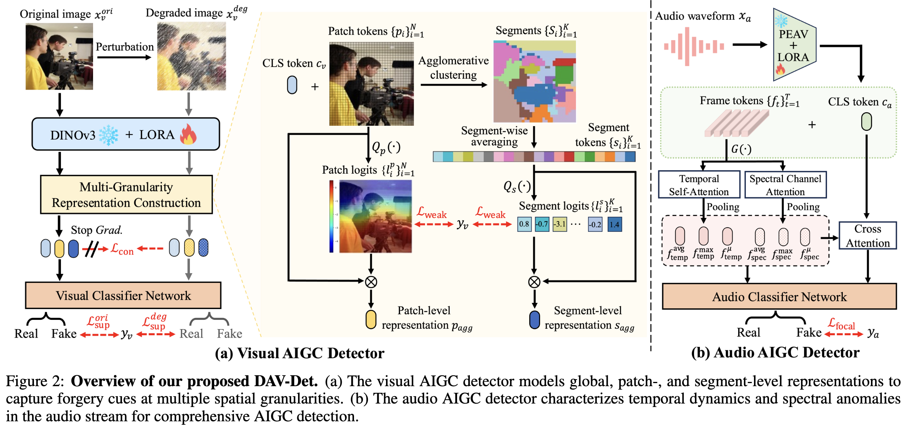

<div align="center">
  <h2><b> Less is More: Modality-Decoupling for General AIGC Audio-Video Detection </b></h2>
</div>

<div align="center">

</div>

<p align="center">
    <a href="https://github.com/tuffy-studio/DAV-Det">
    
  </a>
  &nbsp;&nbsp;&nbsp;
  <a href="https://arxiv.org/abs/2607.25543">
    
  </a>
  &nbsp;&nbsp;&nbsp;
  <a href="https://huggingface.co/JielunPeng/DAV-Det/">
    
  </a>
</p>

## News

- 🏆 **[June 2026]**  Our method ranked 1st in the [General AIGC Audio-Video Detection challenge](https://www.codabench.org/competitions/15769/#/pages-tab).
- 🎉 **[June 2026]**  The training and inference code is released.
- 🤗 **[June 2026]**  The model weights of DAV-Det trained on the MVAD dataset are provided [here](https://huggingface.co/JielunPeng/DAV-Det).
- 🤗 **[July 2026]**  The model weights of DAV-Det trained on the FakeAVCeleb dataset are provided [here](https://huggingface.co/JielunPeng/DAV-Det).
- 📖 **[July 2026]** Our solution paper is available [here](https://arxiv.org/abs/2607.25543).

## Overview

This repository contains the official implementation of "Less is More: Modality-Decoupling for General AIGC Audio-Video Detection", which is also the solution of our team (HIT VIRLAB) for the [General AIGC Audio-Video Detection challenge](https://www.codabench.org/competitions/15769/#/pages-tab) at IJCAI 2026 DDL 2.0 workshop. Our method achieved **1st** place among 101 participating teams in the final test phase.




It implements a **Decoupled Audio-Visual AIGC detection system**:

- **Audio Detector** exploits both temporal and spectral irregularities via a gated temporal-spectral dual-branch architecture to model acoustic artifacts. 
- **Video Detector** leverages multi-granularity representations at global, patch, and segment levels to capture spatial forgery cues to classify video as real or fake. 
- **Decision-Level Fusion for Inference**: During inference, the two detectors operate independently and their predictions are fused to enable both binary (real/fake) and four-class (RR / FF / FR / RF)  classification.


<!-- ## Directory Structure

```
DAV-Det/
├── data_preprocessing/          # Data preprocessing scripts
│   ├── make_video_csv.py        # Generate video_path,label CSV from directory structure
│   ├── frame_sampling.py        # Uniformly sample frames from videos
│   └── audio_extraction.py      # Extract audio from videos as WAV using ffmpeg
├── src/
│   ├── audio_detector/          # Audio detector
│   │   ├── train.py             # Training entry point
│   │   ├── inference.py         # Inference entry point
│   │   ├── dataloader.py        # Data loading and audio augmentation
│   │   ├── loss_function.py     # Focal Loss
│   │   └── models/              # PE-AV encoder / AASIST backend / detector wrapper
│   └── video_detector/          # Video detector
│       ├── run_training.py      # DDP training entry point
│       ├── training.py          # Training loop
│       ├── inference.py         # Inference entry point
│       ├── dataloader.py        # Data loading and image augmentation
│       ├── loss_fn.py           # Focal Loss
│       └── models/              # DINOv3 / GPS-DINO / classifier modules
├── make_2_and_4_result.py       # Fuse audio and video probabilities
├── README.md                    # This file
└── Technical_Report.md          # Technical report (methodology, architecture, etc.)
```

--- -->

## 1 Independence

### 1.1 Environment Setup

We recommend using separate Conda environments for the audio and video detectors to avoid dependency conflicts.

#### Audio Detector Environment

```bash
conda create -n audio_detector_env python=3.11.14
conda activate audio_detector_env
pip install -r src/audio_detector/audio_requirements.txt
```

#### Video Detector Environment

```bash
conda create -n video_detector_env python=3.10.20
conda activate video_detector_env
pip install -r src/video_detector/video_requirements.txt
```

### 1.2 Download Pretrained Models Weights and Configures


| Model | Source | Placement |
|---|---|---|
| PE-AV Base | [huggingface.co/facebook/pe-av-base](https://huggingface.co/facebook/pe-av-base) | `./src/audio_detector/` |
| DINOv3 ViT-L/16 | [ModelScope - dinov3-vitl16-pretrain-lvd1689m](https://www.modelscope.cn/models/facebook/dinov3-vitl16-pretrain-lvd1689m) | `./src/video_detector/` |


## 2 Data Preprocessing


Please download the MVAD dataset from https://github.com/HuMengXue0104/MVAD. The training set should be organized as follows (four categories correspond to audio/video real-fake combinations):

```
train/
├── fake_fake/          # fake audio & fake video -> video binary label=1, audio label=1
├── fake_real/          # fake audio & real video -> video binary label=1, audio label=0
├── real_fake/          # real audio & fake video -> video binary label=0, audio label=1
└── real_real/          # real audio & real video -> video binary label=0, audio label=0
```

### 2.1. Generate Video Label CSV and Frame Sampling

Run the following command to generate the video label CSV file:

```bash
python data_preprocessing/make_video_csv.py
```

Before execution, please update the `train_dir` and `output_csv` variables in the script according to your dataset path and desired output location.

The generated CSV file follows the format below:

```csv
video_path,label
/path/to/train/fake_fake/xxx.mp4,1
/path/to/train/real_real/yyy.mp4,0
```

Then run the following command to sample frames from videos:


```bash
python data_preprocessing/frame_sampling.py
```

Before running, configure the following parameters in the script:
- `input_csv`: CSV generated by `make_video_csv.py`
- `save_root`: root directory to save sampled frames
- `output_csv`: final `frame_path,label` CSV for visual detector training

**Sampling strategy**:
- Real videos (label=0): uniformly sample **8 frames**
- Fake videos (label=1): uniformly sample **16 frames**

**Output structure**:

The sampled frames are organized as follows:
```
frames_sampling/
├── 0/          # real videos
│   └── {video_name}/
│       ├── 000.jpg
│       └── ...
└── 1/          # fake videos
    └── {video_name}/
        ├── 000.jpg
        └── ...
```

### 2.2. Audio Extraction

Run the following command to extract audio from videos:

```bash
python data_preprocessing/audio_extraction.py
```

Before running, configure the following parameters in the script:
- `base_dir`: training set root directory
- `output_csv`: output `file_path,label` CSV for the audio detector training

Processing logic:
- If `.wav` / `.flac` already exists in the video directory, use it directly
- Otherwise, use `ffmpeg` to extract audio as `16kHz` WAV

Audio extraction is accelerated using multi-process parallel processing, with up to 16 workers by default.


## 3 Training

> **Note**: We recommend training the audio and video detectors in their own environments (see [1.1 Environment Setup](#11-environment-setup)). Both detectors have their own example launch scripts (`src/audio_detector/train.sh` and `src/video_detector/training.sh`) where you only need to fill in the data paths.

### 3.1 Video Detector Training

 Activate the video detector environment first:

```bash
conda activate video_detector_env
```

Then edit the empty paths in `src/video_detector/training.sh` and run:

```bash
cd src/video_detector
bash training.sh
```

Training outputs (`model.{epoch}.pth`) are saved in `--save_dir`.


### 3.2 Audio Detector Training
Activate the audio detector environment first:

```bash
conda activate audio_detector_env
```

Then edit the empty paths in `src/audio_detector/train.sh` and run:

```bash
bash src/audio_detector/train.sh
```
Checkpoints (`audio_model.{epoch}.pt`) are saved in `--save_dir`.

## 4 Inference

Before evaluation or inference, please prepare your trained model weights, or download the weights provided by us. 
After downloading, place the weights in:

- Audio weights: `./src/audio_detector/weights/`
- Video weights: `./src/video_detector/weights/`

### 4.1 Audio Detector Inference

The audio detector accepts both raw audio files (`.wav`, `.flac`, `.mp3`, etc.) and video files (`.mp4`, etc.). For video inputs, the audio track is automatically extracted via `ffmpeg` and saved as a mono `16 kHz` WAV file in the same directory.

```bash
conda activate audio_detector_env
cd src/audio_detector
bash inference.sh
```

Input CSV format:

```csv
file_path
/path/to/audio.wav
/path/to/video.mp4
```

Output CSV format:

```csv
file_path,prob
/path/to/audio.wav,0.9823
/path/to/video.mp4,0.1234
```

`prob` is the **fake probability**.

### 4.2 Video Detector Inference

```bash
conda activate video_detector_env
cd src/video_detector
bash inference.sh
```

Input CSV format:

```csv
video_path
/path/to/video.mp4
```

Output CSV format:

```csv
video_path,prob
/path/to/video.mp4,0.8523
```

`prob` is the **fake probability**.

> **Note**: Because the video detector is actually a **frame-level detector**, we also provide a frame-level prediction script at `src/video_detector/inference_image.sh`. You can use it to directly predict fake probabilities for individual image frames.
> Before running, fill in the empty paths in `inference_image.sh`.

### 4.3 Decision-Level Fusion

After obtaining audio and video fake probabilities, run the fusion script to generate the final binary and four-class predictions:

```bash
python ./evaluation/make_2_and_4_result.py
```

Update `audio_csv` and `video_csv` paths in the script. Two output files will be generated:

- `binary.txt`: binary classification result (real / fake)
- `four_class.txt`: four-class result (RR / FF / FR / RF)

Fusion strategy:

- **Binary**: take the maximum of audio fake probability and video fake probability as the final fake probability.
- **Four-class**: estimate the joint distribution from the two modalities' real/fake probabilities.


## 5 Contact

If you have any questions or concerns, please contact:

📧 **[jielunpeng.hit@gmail.com](mailto:jielunpeng.hit@gmail.com)**

📧 **[25s003052@stu.hit.edu.cn](25s003052@stu.hit.edu.cn)**

or feel free to submit an issue in this repository.
